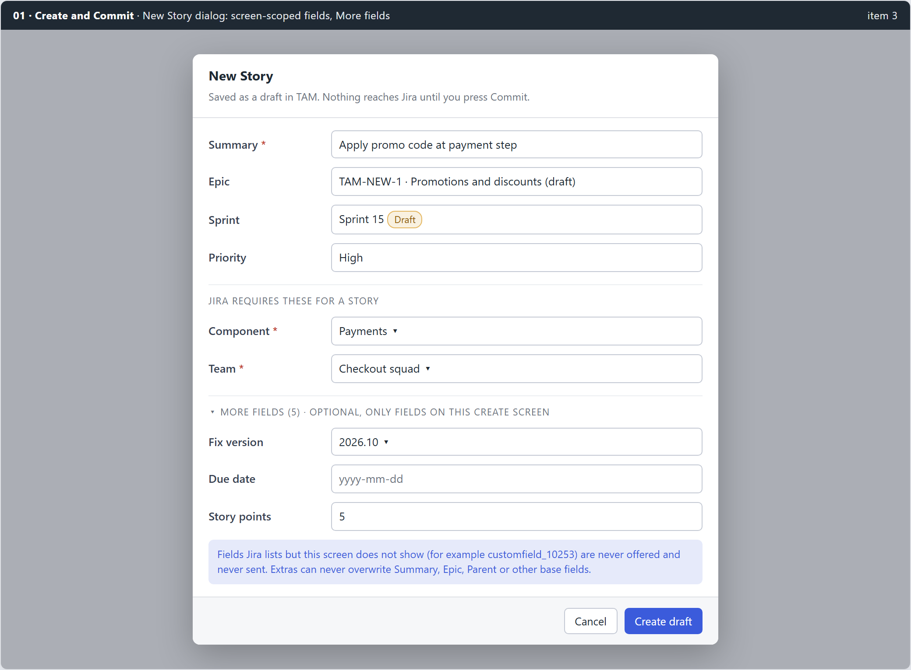
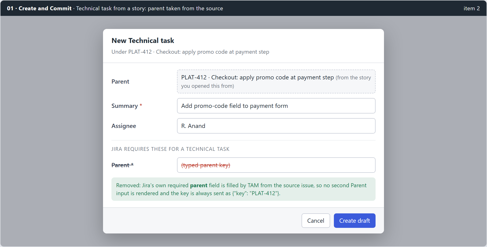
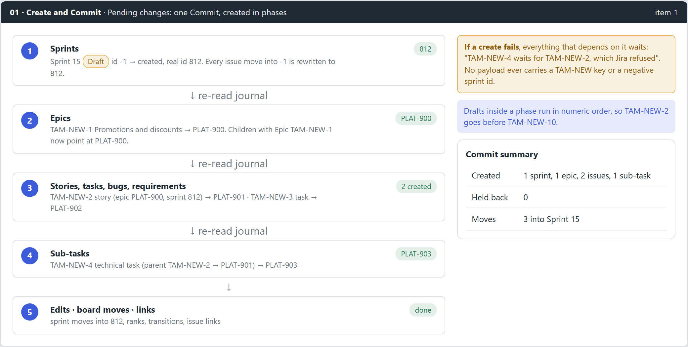

# 01 - planning (feat:create-commit-correctness)

Mirror of Outline: Tools › Task Activity Manager (TAM) › Planning › 01 - planning (feat:create-commit-correctness). Approved 2026-09-15.

## Summary

Answers request items **1**, **2** and **3**. A sprint, an epic, its stories and their technical tasks drafted together must commit in one press without a single 400. TAM creates them in dependency order, rewriting every `TAM-NEW-n` placeholder and draft sprint id before any payload that names it leaves the machine (the XTM phased commit, adapted). A technical task drafted from a story takes its parent from that story and never asks for it. The create dialog offers only the fields that exist on the issue type's create screen, and the payload can never overwrite TAM's own base fields.

## Problem and root cause

### Item 1: creating sprint, epic, story and task together fails

- Sprints are not drafts. `tam/internal/sprints/manage.go:48` creates a sprint in Jira the moment the dialog is confirmed, and the New issue sprint picker only lists real sprints, so a plan that starts with a new sprint cannot be drafted offline at all.
- The committer creates in one flat pass. `tam/internal/committer/committer.go:108-158` sorts the pending creates with `sort.Strings`, so `TAM-NEW-10` is pushed before `TAM-NEW-2`, and a child can be posted while its epic is still a placeholder. Jira answers that with a 400 on the Epic Link or parent value.
- Nothing holds dependents back. When the epic create fails, its stories are still posted with `TAM-NEW-1` in the payload.

XTM already solves the same shape in `xtm/internal/syncer/commit.go` `commitChanges`: preconditions, then containers, then tests, then folders, then per-test edits, then trailing passes, each create followed by a rename of the placeholder across every table and a re-read of the journal.

### Item 2: technical task asks for a parent key

`tam/internal/backend/jira/writes.go` `CreateFields` (256-293) returns every required field from createmeta. For a sub-task type Jira lists `parent` as required. `formFields` (251-254) does not include `parent`, so `NewIssueModal.tsx` (480-504, `MetaField`) renders a second Parent input under the parent already stated from the source story.

### Item 3: 400 on commit, `customfield_10253` not on the screen, `parent: data was not an object`

- `CreateIssue` (`writes.go:105-183`) sets `fields["parent"] = {"key": ...}` and then applies `d.Extra` unguarded. The duplicate Parent input from item 2 put a plain string into `Extra["parent"]`, which overwrote the object: `parent: data was not an object`.
- `customfield_10253` came from the classic `/rest/api/2/issue/createmeta?expand=projects.issuetypes.fields` answer, which on some Data Center versions lists fields that are not on that issue type's create screen. Sending it gives `Field cannot be set. It is not on the appropriate screen`.
- XTM avoids both: `GetBugCreateFields` (`xtm/internal/jira/bugs.go:330-396`) reads per-type metadata, and its merge only adds an extra when `if _, exists := fields[k]; !exists`.

## Decisions

| Question | Decision | Not taken |
|---|---|---|
| New sprint in an offline plan | **Sprint becomes a draft** with a negative placeholder id, created on Commit | Keep sprints immediate and make the user create them first |
| Which fields the dialog shows | **Required and optional, screen scoped**, optional ones behind "More fields" | Required only; or every createmeta field |
| Order of creation | **Phased Commit** modelled on XTM | Topological sort over one flat list |
| Failure of a create | **Dependents are held**, with a reason naming the blocker | Continue and let Jira refuse each child |

Real sprint edit, delete, start and complete stay immediate writes. Only the *creation* of a sprint moves into the journal, so `internal/sprints/exceptions_test.go` changes: `Create` leaves the immediate method set and a new journaled path is added.

## Design

### A1. Screen-scoped create dialog

- **Per-type createmeta.** New reader in `core/jira`: `GET /rest/api/2/issue/createmeta/{projectKey}/issuetypes/{issueTypeId}` (Data Center 8.4+), paged, falling back to the classic expand call only when the new endpoint answers 404. The response is per type, and a field absent from it is not on the screen.
- **Field split.** Base fields TAM already owns (summary, description, priority, labels, assignee, story points, Epic Link, Epic Name, parent, issuetype, project, sprint) are removed from the extras list. Remaining fields: `required` shown in the "Jira requires these" section, others in a collapsed "More fields (n)" section.
- **Shaping moves to core.** `shapeExtra` and the createmeta parsing lift into `core/jira/createmeta.go` so XTM and TAM share one implementation: option id for allowed values, `{"value": ...}` for free text on option fields, arrays for array schemas, `{"name": ...}` for user fields, ISO date for date fields.
- **Payload guard.** `CreateIssue` applies extras with the XTM exists-guard and refuses any extra whose key is not in the per-type metadata it was drafted against. The metadata id set is stored on the draft row so Commit can check it without a network call.

### A2. Technical task parent from the source

- `CreateFields` never returns `parent`, `Epic Link` or `Epic Name` as extras, whatever createmeta says.
- The detail panel "+ Technical task" button opens the dialog with `lockType` and a fixed `parentKey`; the Parent row is a stated value, not an input.
- A parent that is itself a draft (`TAM-NEW-2`) is allowed. The sub-task lands in phase 4, after its parent has a real key.

### A3. Phased Commit

**Phases**, each followed by a re-read of the journal:

1. **Sprint drafts.** `POST /rest/agile/1.0/sprint`, then rewrite the negative id everywhere: `issue.sprint_id`, `issue_sprint` journal rows (`before_val`/`after_val`), draft JSON.
2. **Epics.** Create, then `Rekey` (existing), and additionally rewrite `parentKey` in every other draft's JSON and every pending `parentKey` edit that names the placeholder.
3. **Story, task, bug, requirement.** Same rekey plus rewrite.
4. **Sub-tasks.** Parent must be a real key by now.
5. **Edits**, then the existing **board pass** (sprint moves, transitions, ranks), then **links**.

**Rules**

- Inside a phase, drafts run in numeric order of `n` (`draftOrdinal`), never string order.
- **Placeholder firewall.** `committer.assertNoPlaceholders(payload)` walks the outgoing JSON; any `TAM-NEW-` string or negative sprint id aborts that one write with an internal error, so a bug in rewriting can never reach Jira as a 400.
- **Held dependents.** A create that fails marks its placeholder as blocked; any draft, edit, move or link that references it is skipped with `Held: "waits for TAM-NEW-2, which Jira refused"`, stays in the journal, and is retried next Commit.
- **Partial success is kept.** A sprint created in phase 1 stays created if phase 2 fails; its id is already rewritten locally.

**Draft sprints**

- Schema version 13: `sprint` accepts negative ids for drafts; a `draft` flag column; journal entity `sprint_create` holding name, goal, dates, board id.
- Sprints view and pickers list draft sprints with a **Draft** chip. Start and Complete are disabled with a tooltip ("Commit this sprint first"). Edit and Delete of a draft are local.
- Discard removes the sprint row and clears `sprint_id` on any issue pointing at it.

## Implementation tasks

1. `core/jira/createmeta.go`: per-type reader with classic fallback, parsing and shaping lifted from TAM; tests with both response shapes recorded from fixtures.
2. TAM backend `CreateFields` on the new reader; base-field exclusion list; `schema.required` split; draft stores metadata field ids.
3. `CreateIssue` exists-guard and screen check; tests reproducing both 400s from the ticket.
4. `NewIssueModal`: "More fields" collapse, locked parent row, no Parent `MetaField`; Vitest.
5. Schema v13 and `sprint_create` journal entity; `issuerepo` draft sprint create, edit, delete, discard.
6. Sprints view, pickers and `SprintField` show draft sprints; Start and Complete disabled for drafts; `exceptions_test.go` updated with the reason.
7. Committer phases 1-4 with `draftOrdinal`, placeholder rewriting helpers (`rewriteSprintID`, `rewriteParentKey`) and journal re-read between phases.
8. `assertNoPlaceholders` firewall and held-dependent bookkeeping; Pending changes dialog shows held rows with their reason.
9. Demo backend: honour draft sprints and staged failure of one epic create for manual testing.
10. Docs: `tam/CLAUDE.md` sections on the create dialog, draft sprints and phased Commit; User Guide.

## Testing

- **Go:** committer table tests for sprint + epic + 2 stories + sub-task in one Commit, with `TAM-NEW-10` ordering; epic failure holds exactly its descendants; firewall trips on an injected unreplaced key; createmeta shaping for option, array, user, date, number fields.
- **Frontend:** dialog hides `parent` and base fields; More fields count; draft sprint chip and disabled ceremonies.
- **Manual, demo profile:** draft Sprint 15, epic, story under it, technical task under the story, Commit once; check keys, sprint membership and parent.
- **Manual, real instance:** the project from the ticket, Story and Technical task types, confirm no `customfield_10253` in the request log.

## Risks and probes

- **Probe first:** call both createmeta endpoints for Story and Technical task on the real instance and record whether `customfield_10253` appears in each. If the per-type endpoint also lists it, the screen check needs `operations` or the field's `hasDefaultValue` to decide, and this design is revised before task 2.
- Data Center versions before 8.4 lack the per-type endpoint; the fallback keeps today's behaviour plus the exists-guard.
- Sprint create needs the Manage Sprints permission; a refused sprint holds every move into it, which is the intended outcome but must read clearly.

## Out of scope

- Journaling sprint edit, delete, start or complete.
- Creating versions, components or other referenced objects that do not exist yet.
- Bulk editing of extra fields after drafting.
