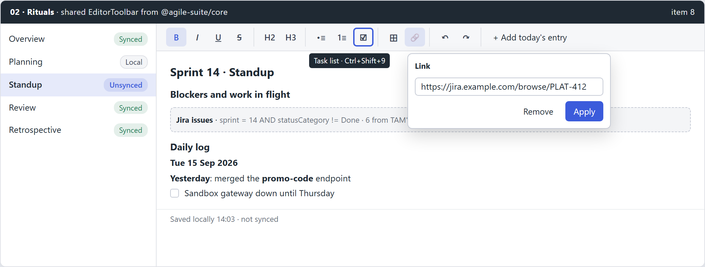
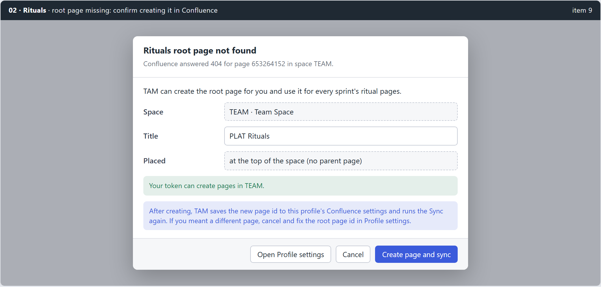

# 02 - planning (feat:rituals-toolbar-root-page)

Mirror of Outline: Tools › Task Activity Manager (TAM) › Planning › 02 - planning (feat:rituals-toolbar-root-page). Approved 2026-09-15.

## Summary

Answers request items **8** and **9**. The ritual editor's hand-built buttons are replaced by a shared, accessible `EditorToolbar` component in `@agile-suite/core`. When Rituals Sync finds that the configured Confluence root page does not exist, TAM stops treating it as a dead end: it checks whether the token can create pages in the space and, with the user's confirmation, creates a root page reflecting the one in TAM, saves its id to the profile and runs the Sync again.

## Problem and root cause

### Item 8: self-made editor buttons

- The toolbar lives inside `tam/frontend/src/components/ritual-editor/RitualEditor.tsx` as a row of plain `<button>` elements with text labels, no grouping, no tooltips, no keyboard model beyond Tab, and a link prompt that closes silently on a refused scheme (a known follow-up from PR #43).
- No editor toolbar component exists anywhere in the suite. XTM has no rich text editor, so there is nothing to lift; the component is new.
- TipTap 3.31.3 is already installed (`BubbleMenu` is available from `@tiptap/react/menus`).

### Item 9: Sync fails on root page 404

- `tam/internal/ritualsync/run.go:62-65` reads the root page first and returns an error on any failure, so a stale or mistyped id produces `confluence: 404 : No content found with id: ContentId{id=653264152}` and the pass ends.
- `core/confluence/pages.go` `CreatePage` always sends `ancestors`, so it cannot create a page at the top of a space.
- `ProfileForm.tsx` accepts any text for the root page id; nothing validates it is numeric.

## Decisions

| Question | Decision | Not taken |
|---|---|---|
| Toolbar source | **Shared EditorToolbar in @agile-suite/core**, editor-agnostic | A third-party toolbar package; TipTap-specific component inside TAM |
| Missing root page | **Confirm dialog, then create** at the top of the configured space | Silently create; or only show the error |
| Permission check | **Probe before offering**, plain 403 message as fallback | Always offer and let the create fail |

## Design

### E1. Shared EditorToolbar



**Component contract** (`frontend/core/src/components/EditorToolbar/`, follow the package's existing layout):

```ts
type ToolbarItem =
  | { kind: 'toggle'; id: string; label: string; icon: IconName; shortcut?: string;
      active: boolean; disabled?: boolean; onToggle: () => void }
  | { kind: 'action'; id: string; label: string; icon?: IconName; text?: string;
      shortcut?: string; disabled?: boolean; onRun: () => void }
  | { kind: 'link'; id: string; label: string; href: string | null;
      onApply: (href: string) => string | null; onRemove: () => void };
type ToolbarGroup = { id: string; label: string; items: ToolbarItem[] };
<EditorToolbar label="Formatting" groups={groups} disabled={locked} />
```

- **Editor agnostic.** The core component knows nothing about TipTap. TAM's `useRitualToolbar(editor)` hook maps TipTap state (`editor.isActive`, `can().chain()`) to groups and re-renders on `transaction`.
- **Groups:** marks (bold, italic, underline, strike), headings (H2, H3), lists (bullet, ordered, task), insert (table, link), history (undo, redo), and a ritual group ("+ Add today's entry" on Standup only). Only items the current editor extensions support are shown.
- **Accessibility:** `role="toolbar"` with `aria-label`; roving tabindex with Left/Right, Home/End; toggles use `aria-pressed`; each group is `role="group"` with its label; tooltip shows label and shortcut on hover and focus.
- **Icons:** inline SVG set in core (`icons.tsx`), `currentColor`, 16px, so dark mode and high contrast follow tokens.
- **LinkPopover:** anchored to the link button; Enter applies, Escape closes and returns focus; `onApply` returns an error string, shown inline, for a refused scheme (fixes the silent close). Allowed schemes stay `http`, `https`, `mailto`.
- **Locked state:** during a Sync the toolbar renders disabled rather than hidden, so layout does not jump. (Today the toolbar is hidden when locked; the editor itself stays `setEditable(false)` exactly as now.)

### E2. Root page missing



**Flow**

1. `ritualsync.Run` reads the root page. On 404 it returns `Result{RootMissing: &RootMissing{PageID, SpaceKey, CanCreate, SuggestedTitle}}` instead of an error (Wails returns either value or error, never both, so the reason must travel in the result).
2. `CanCreate` comes from a probe: `GET /rest/api/content?spaceKey={key}&limit=1` (space readable) plus the user's space permission when the instance reports it; unknown is treated as "try" (true).
3. The Rituals view opens the dialog: space, editable title (default `<Project key> Rituals`), placement "top of the space".
4. **Create page and sync** calls new binding `CreateRitualRoot(title)`: `CreatePage` without ancestors, then writes the new id to the profile's Confluence settings, then runs the Sync under the same `rituals` lock.
5. A 403 on create shows "Your token cannot create pages in TEAM. Ask a space admin, or set an existing page id in Profile settings." with a button that opens Profile settings.
6. A 400 for a duplicate title offers to adopt the existing top-level page with that title after a second confirmation, using the existing find-by-title call.

**Core change:** `CreatePage` takes `ParentID string`; empty omits `ancestors`.

**Profile validation:** `ProfileForm` rejects a non-numeric root page id with an inline message; a pasted page URL is parsed for its `pageId` query value.

## Implementation tasks

1. `EditorToolbar`, `ToolbarButton`, `LinkPopover`, `icons.tsx` in `frontend/core`, with Vitest for roving focus, pressed state, popover apply/refuse/escape.
2. `useRitualToolbar` in TAM; replace the hand-built toolbar in `RitualEditor.tsx`; keep "Add today's entry" behaviour and its once-a-day refusal.
3. `core/confluence` `CreatePage` optional ancestors; test both payloads.
4. `ritualsync` `RootMissing` result and permission probe; demo space staged missing root.
5. `CreateRitualRoot` binding under the `rituals` lock; saves profile setting; runs Sync.
6. Rituals view dialog with create, 403 and duplicate-title outcomes; `ProfileForm` root id validation and URL parsing.
7. Docs: `tam/CLAUDE.md` rituals section, User Guide rituals page.

## Testing

- **Core frontend:** keyboard model, tooltip text includes shortcut, disabled group, link popover error.
- **Go:** Sync with a 404 root returns `RootMissing` and no error; create without ancestors; profile setting written; second Sync uses the new id.
- **Manual, demo profile:** set root id to `1`, press Sync, confirm, pages created under the new root.
- **Manual, real instance:** the profile from the ticket (root `653264152`); record the probe answer for a token with and without create permission.

## Risks and probes

- **Probe:** what the real Confluence Data Center answers for the permission probe and for a duplicate top-level title (400 or 409). The dialog wording for those two cases depends on it.
- A top-level page in a busy space may be unwanted; the dialog states placement explicitly and offers Profile settings instead.
- Existing local ritual pages keep their page ids from the old root. If the old root truly vanished, those pages are also gone and the existing "gone" handling applies; the confirm text says the pages will be recreated under the new root.

## Out of scope

- Choosing a parent page inside the space from a tree picker.
- Moving existing ritual pages between roots.
- Tables toolbar (row and column operations) beyond inserting a table.
