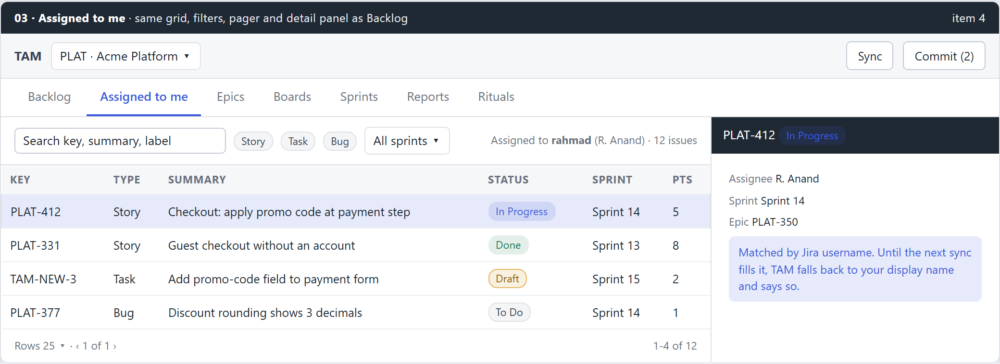

# 03 - planning (feat:assigned-to-me)

Mirror of Outline: Tools › Task Activity Manager (TAM) › Planning › 03 - planning (feat:assigned-to-me). Approved 2026-09-15.

## Summary

Answers request item **4**. A new **Assigned to me** tab lists every issue in the synced project assigned to the connected Jira user, with exactly the Backlog's grid, filters, sorting, pager and detail panel. It reads only `tam.db`, so it works offline, and includes drafts the user assigned to themselves.

## Problem and root cause

- **TAM does not know who "me" is.** `TestConnection` gets `backend.User{Name, DisplayName}` from Jira but only surfaces the display name in the dialog; nothing is persisted per profile.
- **The cache cannot match by user.** The issue row's `assignee` column holds the display name only (`internal/backend/jira/fields.go:185`). Display names are not unique and change; the write path already uses the username (`{"assignee": {"name": ...}}`).
- **The query cannot filter by assignee.** `issuerepo.IssueQuery` has type, status, sprint, search and sort, but no assignee.
- **Backlog is not reusable.** `BacklogView` owns its toolbar, filters, table and pager in one component, so a second list would copy it.

## Decisions

| Question | Decision | Not taken |
|---|---|---|
| Scope of the list | **Synced project only** (what the profile already caches) | A cross-project `assignee = currentUser()` live query |
| Where it lives | **A tab next to Backlog**, same UI | A filter chip inside Backlog |
| How "me" is matched | **Jira username**, stored per profile | Display name |

## Design

### B1. Assigned to me tab

**Knowing the user**

- Profile settings `jira_username` and `jira_display_name`, written by `TestConnection` and refreshed at the start of every sync (one `GET /rest/api/2/myself`, cheap). Demo profile answers a fixed demo user.
- The header line states who the list is for: "Assigned to **rahmad** (R. Anand) · 12 issues".

**Caching the assignee key**

- The next schema version (v14, since bundle 01 takes v13 on this branch) adds `assignee_name` to `issue`, written by the sync normaliser from `fields.assignee.name` (Data Center; fall back to `key` when `name` is empty) and set by edits and drafts from `AssigneePicker`, which already stores the username.
- The migration **clears the sync watermark** of every profile, the same reason version 5 did for `status_id`: incremental sync would never backfill the column otherwise.
- Until the next sync fills it, the query falls back to `assignee = jira_display_name` for rows with an empty `assignee_name`, and the view shows "Showing matches by display name until the next sync".

**Query**

- `IssueQuery` gains `AssigneeName string`. `issuerepo` adds `WHERE (assignee_name = ? OR (assignee_name = '' AND assignee = ?))`. Drafts are included when their assignee matches.
- A pending assignee edit counts: an issue reassigned to me locally appears; one reassigned away disappears, exactly as the Backlog already overlays pending edits.

**Reusing the Backlog**

- Extract `IssueListView` from `BacklogView`: toolbar (search, type chips, sprint filter, sort line), `IssueTable`, pager, detail panel and resize grip, parameterised by `baseQuery: Partial<IssueQuery>`, `label`, and which toolbar actions show (Import and + New stay on Backlog only).
- `BacklogView` becomes `<IssueListView baseQuery={{}} ... />`; `AssignedToMeView` becomes `<IssueListView baseQuery={{ assigneeName: me }} ... />`.
- Filter, sort and page state are kept separately per tab (query key includes the view id), so switching tabs never resets the other.
- **Navigation:** `VIEWS` in `nav.ts` and `menuViews` in `main.go` gain `assigned` between Backlog and Epics, kept in step by hand as documented.
- **No username yet** (profile never tested or synced): empty state "TAM does not know your Jira user yet. Sync once or test the connection." with both buttons.

## Implementation tasks

1. Profile settings `jira_username`, `jira_display_name`; written by `TestConnection` and at sync start; demo user.
2. Schema migration: `assignee_name` column, watermark clear; normaliser writes it; `EditField` and `CreateDraft` set it.
3. `IssueQuery.AssigneeName` with display-name fallback and pending-edit overlay; repository tests.
4. Extract `IssueListView` from `BacklogView` with no behaviour change; existing Backlog tests stay green.
5. `AssignedToMeView`, tab, native menu entry, empty states, per-view query keys; Vitest.
6. Docs: `tam/CLAUDE.md` navigation and query sections, User Guide.

## Testing

- **Go:** migration clears watermarks and adds the column; query matches by username, falls back by display name only for empty rows, includes a matching draft, honours a pending reassignment both ways.
- **Frontend:** extracted list renders identically for Backlog (toolbar and columns); tab state independence; empty state without a username.
- **Manual, demo profile:** assign a story to the demo user in the detail panel, see it appear in Assigned to me before Commit.
- **Manual, real instance:** two users with the same display name in the project; only the connected username's issues are listed after sync.

## Risks and probes

- Jira Data Center with GDPR mode (`key` rather than `name` for some users): the normaliser stores `name` and falls back to `key`; confirm on the real instance which one `fields.assignee` carries.
- The first sync after the migration is a full sync and takes longer; the release note says so.

## Out of scope

- Issues assigned to me in other projects.
- "Reported by me" or "watched by me" lists.
- Notifications for newly assigned issues.
