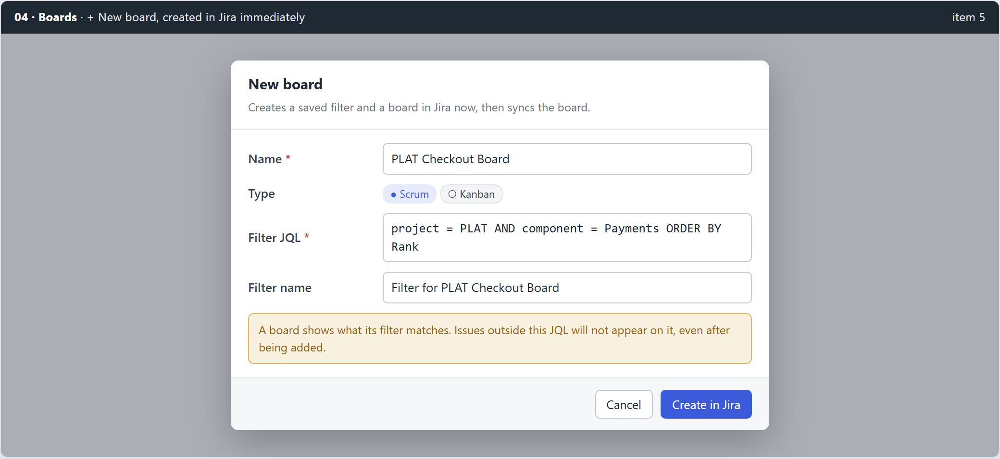
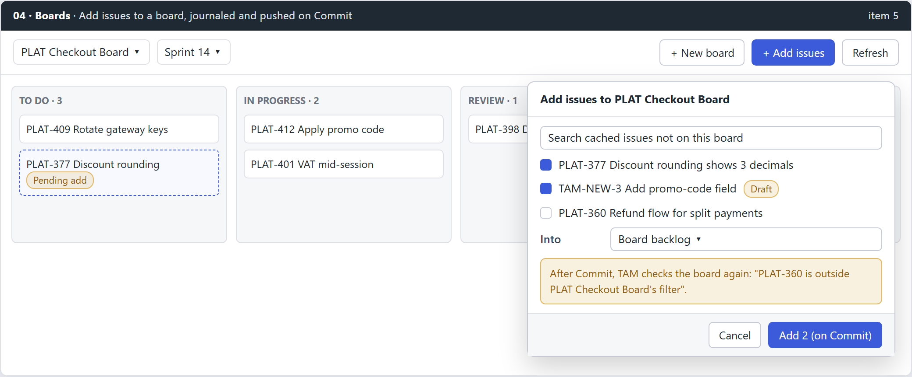

# 04 - planning (feat:boards-create-attach)

Mirror of Outline: Tools › Task Activity Manager (TAM) › Planning › 04 - planning (feat:boards-create-attach). Approved 2026-09-15.

## Summary

Answers request item **5**. The Boards view gains **+ New board**, which drafts a scrum or kanban board locally and creates it, with its filter, on Commit, and **+ Add issues**, which journals chosen issues (drafts included) onto a board and pushes them on Commit like every other board write. After Commit, TAM tells the user plainly when an added issue is outside the board's filter and therefore will not show.

> **Amended 2026-09-16, after approval.** The original design made board create
> an immediate Jira write, on the same cost argument the sprint writes use. The
> maintainer has since set a standing local-first rule: no feature writes to
> Jira directly, everything is journalled and pushed on Commit, so that TAM
> works with no connection at all. Board create is therefore a draft board on
> a negative id, following the draft-sprint pattern bundle 01 established.
> Sections C1 and the Decisions table below are rewritten; the Outline mirror
> needs the same edit.

## Problem and root cause

- **No create call exists.** `core/jira/agile.go` has reads plus `RankIssue`, `MoveToSprint`, `MoveToBacklog`, `StartSprint`, `CompleteSprint`; `sprintwrite.go` has sprint create, update, delete. There is no filter or board create.
- **No attach path exists.** Board membership in TAM is only what `/board/{id}/issue` answered at sync time. Nothing journals "put this issue on this board".
- **Drafts look attached when they are not.** `boardrepo` `composeBoard` appends `DraftIssues` to every board and every sprint, so a new issue appears on all boards locally and on none in Jira.

## Decisions

| Question | Decision | Not taken |
|---|---|---|
| New board | **Journaled draft board** on a negative id, filter and board both created on Commit | Immediate write, then board sync |
| Add issues | **Journaled**, pushed on Commit | Immediate call from the picker |
| Board filter mismatch | **Warn after Commit**, never edit the filter | Rewrite the board's JQL automatically |

**Board create is journaled, not immediate.** The first version of this design
made it an immediate write on the same cost argument the sprint writes use: a
board has no cached version, no conflict story and no rekey path, and a user
does it rarely. That argument is closed. TAM is local-first: no feature writes
to Jira directly, because a feature that does is unavailable offline, carries a
second error path the journal's conflict story does not cover, and lands before
the user can review or discard it.

The pattern already exists. Bundle 01 made sprints draftable: a negative id, a
`sprint_create` journal entity, `RekeySprint` to repoint the rows once Jira
hands back a real id, and `assertNoPlaceholders` guarding every call site. A
draft board is the same shape one level up, and it keeps board create off
`sprints.Service`, whose `exceptions_test.go` fences the immediate-write set to
exactly the four sprint operations that predate this rule.

**Ordering matters and is not obvious.** A draft sprint carries an
`originBoardId`, so a draft sprint created on a draft board cannot be pushed
until the board is real. The board-create phase therefore runs **before** the
sprint phase, and a draft sprint whose board create failed is held with a
reason rather than sent with a negative id.

## Design

### C1. New board

- **Transport** (`core/jira/boardwrite.go`):
  - `CreateFilter(name, jql, description) (FilterID, error)`: `POST /rest/api/2/filter`, shared with the project by default (`sharePermissions: [{type: "project", project: {id}}]`).
  - `CreateBoard(name, type, filterID, projectKey) (BoardID, error)`: `POST /rest/agile/1.0/board` with `location: {type: "project", projectKeyOrId}`.
  - A board create that fails after the filter was created deletes the filter (`DELETE /rest/api/2/filter/{id}`) and reports both outcomes.
- **No service layer, and no new lock.** Journalling deletes the whole
  `internal/boards.Service` layer the immediate version needed, along with its
  `board` lock name, its `runQuietLock` path, its binding and its fence test.
  A draft board is a row plus a journal entry, written by `issuerepo` the way
  `CreateDraftSprint` already is, and pushed by the committer. The dialog is an
  ordinary local write: no lock, no in-flight modal state, nothing to refuse
  Escape for.
- **Draft board:** `board.draft` (schema 14, the same migration shape sprint's
  `draft` flag took at 13) plus a `board_create` journal entity holding the
  board's name, type, filter name and JQL as JSON, on a negative board id.
  Every picker labels it `(draft)`, exactly as draft sprints are.
- **Dialog:** name (required), type scrum or kanban, filter JQL defaulting to
  `project = KEY ORDER BY Rank`, filter name defaulting to
  `Filter for <board name>`. **The JQL is not validated against Jira**: a
  validate-on-blur call is a direct Jira connection in a local-first feature,
  and it would be the only thing in the dialog that needs a network. A bad JQL
  fails at Commit with Jira's own message, the same as every other journalled
  write.
- **On Commit:** create the filter, then the board, then rekey. A board create
  that fails after its filter was created deletes the filter and reports both
  outcomes, so a failed push leaves nothing behind.
- **After Commit:** boards sync for that board, then the picker selects it.
  Kanban board sprint features stay hidden as today.

### C2. Add issues to a board

- **Journal entity** `issue_board`, field `boardId`, `after_val` = `boardId|scope` where scope is `backlog` or a sprint id. Written by `issuerepo.AddToBoard(keys, boardID, scope)` in one transaction; one row per key per board.
- **Picker:** search over cached issues and drafts not already in the board's membership; multi-select; "Into" backlog or an active or future sprint of that board.
- **Drawing:** a pending add is drawn on its target board only, with a dashed outline and a **Pending add** chip, in the first column that collects its status (drafts in the first column, as today).
- **Draft drawing fix:** `composeBoard` stops appending every draft to every board. A draft appears on a board only when it has a pending `issue_board` row, a pending sprint move or sprint id belonging to that board, or a draft sprint of that board.
- **Commit:** new board-add step after creates and before sprint moves.
  - Backlog scope: `POST /rest/agile/1.0/backlog/{boardId}/issue` in batches of 20 (`issues: [keys]`).
  - Sprint scope: the existing `MoveToSprint`, which also puts the issue on the board.
  - 207 is failure for the whole batch, per `core/jira/bulkwrite.go`.
  - Drafts are held until the create phase gives them a key.
- **Filter check after Commit:** for each board touched, read `/rest/agile/1.0/board/{id}/issue?jql=key in (...)&fields=key` and compare. Missing keys produce a Commit result line: "PLAT-360 is outside PLAT Checkout Board's filter, so it will not show on that board." The journal row is still removed: Jira accepted the write.
- **Discard** removes the row; Pending changes lists it as "Add to PLAT Checkout Board (backlog)".

## Implementation tasks

Six, not nine: journalling removed the service layer and its fence, and the
sprint-scope add needs no new transport because `MoveToSprint` already puts an
issue on the board.

1. **Transport and seam.** `core/jira`: `CreateFilter`, `CreateBoard`,
   `DeleteFilter` on the `WriteJSONReturning` idiom; `AddToBoardBacklog` on the
   existing `bulkWrite`, which already treats 207 as a failed batch. A
   `BoardWriter` optional interface, type-asserted like the committer's
   existing `boardWriter`, plus the demo implementation.
2. **Draft boards.** Schema 14 `board.draft`; `board_create` journal entity;
   `CreateDraftBoard`; `RekeyBoard`; `assertNoPlaceholders` extended to
   negative board ids. Modelled on `CreateDraftSprint`/`RekeySprint`
   throughout.
3. **`issue_board`.** The entity, `AddToBoard(keys, boardID, scope)`, discard,
   `PendingMoves`, and the `api.ts` constants. Reuses `recordMove` and
   `MoveValue` packing rather than a second encoding.
4. **The commit phases.** One `boards` phase before `sprints` (a draft sprint
   names an `originBoardId`, so its board must be real first), then the
   board-add step. Draft issues held until they have keys; draft sprints held
   when their board create failed. Post-Commit filter check with result lines.
5. **Drawing and the two surfaces.** `composeBoard` draws pending adds on their
   target board only and stops appending every draft to every board;
   `NewBoardModal` and the add-issues picker, both modelled on
   `CreateSprintModal`.
6. **Docs.** `agents/project/tam-phases.md` (not `tam/CLAUDE.md`, a stub since
   PR #42), including the draft-drawing behaviour change and its release note.

## Testing

- **Go:** filter then board create; board failure deletes the filter; add to backlog batches of 20; 207 fails the batch; draft held until created; filter check reports a missing key without failing Commit.
- **Frontend:** dialog validation and JQL count; picker excludes current members; pending card chip; unattached draft no longer drawn on other boards.
- **Manual, demo profile:** create a kanban board, add a draft and an existing issue, Commit, refresh, both drawn without the chip.
- **Manual, real instance:** create a board on a sandbox project; add one issue that matches and one that does not; confirm the warning.

## Risks and probes

- **Probe:** whether `POST /rest/agile/1.0/board` with `location` is accepted on the target Data Center version and which permission it needs. Journalling softens this: an instance that refuses it fails one Commit phase with Jira's own message and leaves the draft board in the journal to discard, rather than half-creating something from a dialog.
- Filters are private by default; a board over a private filter is visible only to its creator. Default here: share with the project, to be confirmed by the probe.
- Changing draft drawing is a visible behaviour change on existing boards; the release note explains why drafts no longer show everywhere.
- A draft board and a draft sprint on it are two placeholders in one Commit. The phase order handles it, but it is the case most likely to be got wrong, and it is the one to test first.

## Out of scope

- Editing or deleting boards and their filters.
- Column configuration and swimlane settings.
- Removing an issue from a board (only possible by changing the issue or the filter).
