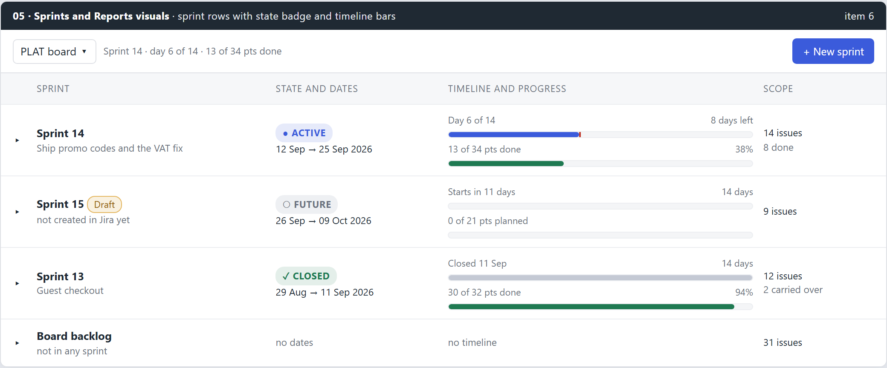
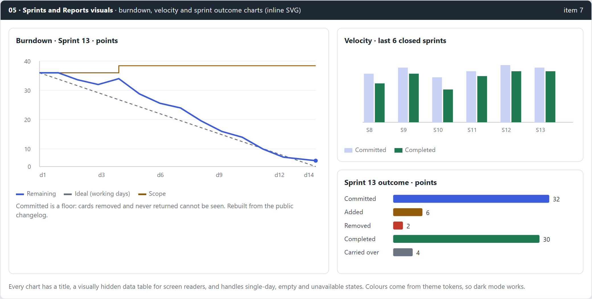

# 05 - planning (feat:sprints-reports-visuals)

Mirror of Outline: Tools › Task Activity Manager (TAM) › Planning › 05 - planning (feat:sprints-reports-visuals). Approved 2026-09-15.

## Summary

Answers request items **6** and **7**. Sprint rows in the Sprints view get a clear state badge, a date range with a relative note, and two bars: time elapsed with a today marker, and points done. Reports gets three hand-built SVG charts drawn from data the view already receives: burndown, velocity and sprint outcome. Every chart keeps the reconstruction caveats, has a hidden data table for screen readers, and follows theme tokens in light and dark mode.

## Problem and root cause

### Item 6: sprint status and timeline hard to read

- `SprintRow.tsx:86-141` prints state as a small text chip and dates as plain text in one cramped cell; the grid is `App.css:569-582`.
- Chip colours are hard-coded (`App.css:166-169`) and do not change in dark mode.
- `lib/format.ts` already has `sprintDates`, `progressText` and `dayOfSprint`, but nothing draws them; there is no badge or progress primitive in `@agile-suite/core`.

### Item 7: reports have numbers and no charts

- `Series.Days` (date, scope, completed, remaining, ideal) already reaches the frontend with the report and is not drawn; the velocity rows (Depth 6) render as a table only.
- No chart library is in the repo. XTM draws its Sankeys by hand in SVG (`SankeyChart.tsx`, `RequirementSankey.tsx`), so hand-built SVG matches the suite.
- `tam/CLAUDE.md` recorded charts as the deliberate next plan, listing the new surface: axis ticks, label collision, empty ranges, single-day sprints, colour tokens, screen reader access.

## Decisions

| Question | Decision | Not taken |
|---|---|---|
| Sprint timeline | **Timeline bar per row** (time and points) | A Gantt strip across all sprints |
| Chart technology | **Hand-built SVG** with a pure scale module | Recharts, Chart.js, ECharts |
| Which charts | **Burndown, velocity, outcome** | Cumulative flow, cycle time |

## Design

### D1. Sprint rows

- **State tokens** in the core styles, light and dark: `--state-active`, `--state-active-soft`, `--state-future`, `--state-future-soft`, `--state-closed`, `--state-closed-soft`, `--state-draft` (from bundle 01), `--bar-track`, `--today-marker`. Replace the hard-coded chip colours.
- **Core primitives:** `StatusBadge` (dot or icon plus uppercase label, never colour alone) and `ProgressBar` (`value`, `max`, `marker?`, `label`, `role="progressbar"` with `aria-valuenow`/`aria-valuetext`).
- **Row layout** (grid columns: caret, sprint, state and dates, timeline and progress, scope):
  - Sprint: name, then goal or "not created in Jira yet" for a draft, with the Draft chip.
  - State and dates: badge, then `12 Sep → 25 Sep 2026`.
  - Timeline: label line (`Day 6 of 14` / `8 days left`; `Starts in 11 days` / `14 days`; `Closed 11 Sep`), time bar with today marker for active sprints; then `13 of 34 pts done` / `38%` and the points bar. Future sprints show `0 of 21 pts planned` with an empty bar; closed sprints grey the time bar.
  - Scope: issue count and one secondary fact (done count, or carried over for closed).
  - Board backlog row: "no dates", "no timeline", issue count.
- **Relative wording** lives in `lib/format.ts` (`sprintRelative(now, start, end, state)`) with tests for day boundaries in the local zone, same-day start and overdue active sprints ("2 days over").
- **Narrow panes:** below 900px the timeline column stacks under the sprint name.

### D2. Report charts

**Scale module** `lib/chartScale.ts` (pure, no React): `linear(domain, range)`, `niceTicks(max, count)` (1, 2, 5 steps), `band(n, width, padding)`, `dayIndex(days)`, `labelEvery(n, width)` to thin x labels and avoid collision. Fully unit tested.

**Chart components** in `components/charts/`

- `BurndownChart`: x = sprint days, y = points or issue count (the report's unit). Lines: remaining (accent, 2.5px), ideal over working days (dashed muted), scope (step line, warn colour). Final point dot. Single-day sprint draws points, not lines. Days after `now` for an active sprint are not drawn.
- `VelocityChart`: last six closed sprints, grouped bars committed (soft accent) and completed (success). Each row keeps its own unit; mixed units draw separate small multiples with a note rather than one misleading axis.
- `OutcomeChart`: horizontal bars for committed, added, removed, completed, carried over, value labels at the bar end.
- **Shared:** `<figure>` with `<figcaption>` title; `role="img"` and `aria-labelledby` on the SVG; a visually hidden `<table>` of the same data; legend as HTML so it wraps; `ResizeObserver` for width, fixed height; colours only from tokens.
- **States:** loading skeleton, unavailable reason (existing `reportText` sentences), empty series ("No days to draw yet"), single closed sprint for velocity.
- **Caveats kept:** the committed-is-a-floor line under burndown and outcome, and the method line, both from `lib/reportText.ts`, unchanged.
- Tooltip on hover and focus per data point showing the day and all three values; keyboard focus moves along points with Left and Right.

## Implementation tasks

1. State tokens light and dark; `StatusBadge` and `ProgressBar` in core with tests.
2. `sprintRelative` and helpers in `lib/format.ts` with local-day tests.
3. `SprintRow` redesign and CSS grid; draft chip; narrow layout; Vitest for each state.
4. `lib/chartScale.ts` with tests for ticks, bands and label thinning.
5. `BurndownChart` with hidden table, tooltip and keyboard focus.
6. `VelocityChart` and `OutcomeChart`.
7. Reports view layout: burndown and outcome for the chosen sprint, velocity beside the table; caveat lines placed under charts.
8. Dark mode and 400px checks; docs: `tam/CLAUDE.md` Phase 4 "charts are next plan" paragraph replaced, User Guide.

## Testing

- **Unit:** scale functions; relative sprint wording across time zones; chart components render the right number of points, bars and hidden table rows for fixtures including single-day, empty and mixed-unit series.
- **Visual (gstack browse):** Sprints and Reports views on the demo profile in light and dark, 1280px and 800px.
- **Accessibility:** badges distinguishable without colour; screen reader reads the hidden table.

## Risks and probes

- Long sprints (over 30 days) crowd x labels; `labelEvery` handles it and the tooltip carries the exact date.
- Mixed units in velocity rows are real (issue count fallback when estimates are missing); the small-multiples fallback must be tested with fixtures that force it.
- SVG text measuring is not available before layout; label thinning uses character-count estimates rather than `getBBox` to keep it pure.

## Out of scope

- Cumulative flow, cycle time and control charts.
- Exporting charts as images.
- Charts inside Confluence ritual pages (those keep the text figures from `reportText`).
