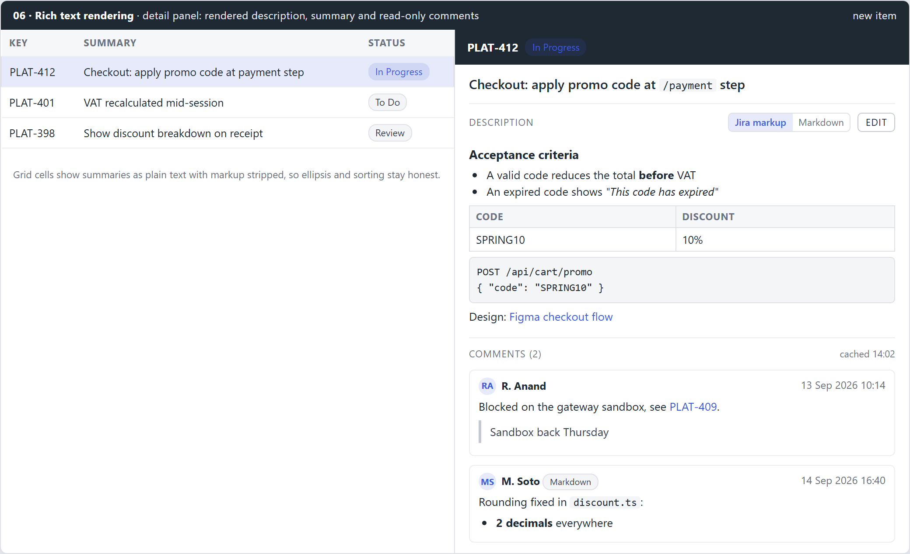
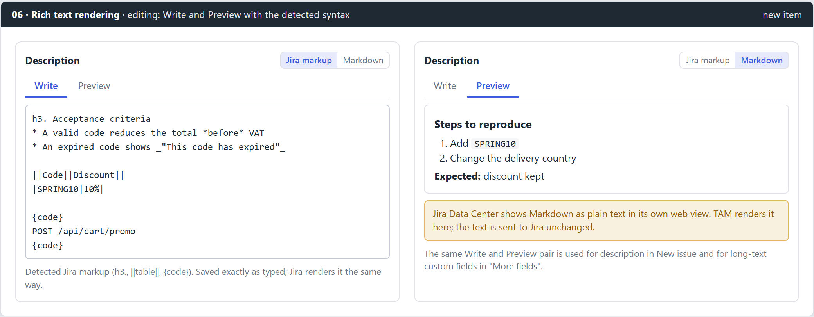

# 06 - planning (feat:rich-text-rendering)

Mirror of Outline: Tools › Task Activity Manager (TAM) › Planning › 06 - planning (feat:rich-text-rendering). Approved 2026-09-15.

## Summary

Answers the request added on 2026-09-15: **render long-text fields** (description, summary, comments, long-text custom fields) instead of showing raw text. Jira Data Center stores these as Jira wiki markup, while some teams type Markdown, so TAM renders **both, detected per field**, with a toggle when detection guesses wrong. The detail panel shows the description rendered with an Edit button that opens Write and Preview tabs, a new **read-only Comments** section cached with the issue detail, and the summary heading with inline formatting. Text is always saved to Jira exactly as typed.

## Problem and root cause

- **Description is only ever a textarea.** `EditableFields.tsx:111-120` renders the description as a 5-row `<textarea>`; there is no read view at all, so a long description with headings, tables and code blocks is read as raw markup.
- **No comments.** `internal/backend/jira/jira.go:143-153` `GetIssueDetail` asks for `description` and `issuelinks` only; comments are never fetched, cached or shown.
- **No renderer exists.** The only rich surface is the ritual editor, which works on Confluence storage XHTML (`lib/storage`), a different format.
- **Two syntaxes in the same field.** Jira wiki markup and Markdown collide: `*bold*` is bold in Jira and italic in Markdown, `h2.` and `{code}` mean nothing to Markdown, `#` is a numbered list in Jira and a heading in Markdown.

## Decisions

| Question | Decision | Not taken |
|---|---|---|
| Syntax | **Both, auto-detected per field**, with a Jira markup / Markdown toggle | Jira markup only; Markdown only |
| Comments | **Read-only Comments section**, cached with the detail | Adding comments; no comments |
| Rendering method | **Parse to an AST, render React elements** (no `innerHTML`) | Jira `renderedFields` HTML; Markdown to HTML string plus sanitizer |
| Where the renderer lives | **The shared @agile-suite/core package**, so XTM can reuse it | Inside TAM only |

Jira's `expand=renderedFields` was considered: it is exact for wiki markup, but it is HTML from the server (needs sanitizing, is wrong for Markdown text, and cannot preview a draft offline). A local parser covers drafts, pending edits and offline reading with one code path.

## Design

### F1. Rendered detail panel and comments

**Renderer** (`frontend/core/src/richtext/`, follow the package's existing layout)

- `ast.ts`: a small block and inline node set: paragraph, heading (1-6), list (ordered, bullet, nested), table (header cells), code block (language), quote, rule, panel (title plus children), text marks (bold, italic, underline, strike, code, sup, sub), link, issue key, line break, image placeholder.
- `wiki.ts`: Jira wiki markup parser. Supports `h1.`-`h6.`, `*bold*`, `_italic_`, `+underline+`, `-strike-`, `{{monospace}}`, `^sup^`, `~sub~`, `[text|url]`, `[url]`, `* ` / `# ` lists with nesting (`**`, `##`, mixed `#*`), `||header||` and `|cell|` tables, `{code[:lang]}`, `{noformat}`, `{quote}`, `bq.`, `{panel[:title=...]}`, `----`, `\\` line break, `{color:...}` (text kept, colour dropped), `!image.png!` (placeholder naming the file). Any other `{macro}` keeps its inner text.
- `markdown.ts`: Markdown via `marked`'s lexer (pinned exact version, MIT, no dependencies) mapped onto the same AST; GFM tables, fenced code, task list items shown as checkboxes (read-only).
- `detect.ts`: scores both syntaxes on unambiguous signals. Wiki: `h\d. `, `{code`, `{noformat}`, `{quote}`, `||`, `[text|http`, `bq. `. Markdown: `^#{1,6} `, fenced code, `[text](url)`, `**x**`, `^\d+\. `, `^- `. Highest score wins; a tie or no signal is **Jira markup**, Jira's own default. Pure and unit tested.
- `RichText.tsx`: `<RichText text format="auto|wiki|markdown" inline? onOpenLink onIssueKey />`. Renders AST nodes as React elements only. Links render only for `http`, `https`, `mailto`; a click never navigates the WebView (same rule as rituals): it calls `onOpenLink`, which TAM wires to `BrowserOpenURL`. Issue keys matching the profile's project are linked through `onIssueKey` (opens in Jira like `IssueKeyLink`).
- `plain.ts`: `toPlainText(text)` strips markup for grid cells, titles and search.
- Large text guard: over 200 KB renders the first 200 KB plus "Showing the first 200 KB. Open in Jira for the rest."

**TAM surfaces**

- **Description:** read view by default, rendered, with the syntax toggle and **Edit**. Edit switches to Write and Preview (F2). The toggle choice is kept per issue and field for the session.
- **Summary:** detail panel heading renders inline nodes only (code, bold, italic, links). Grid cells, board cards, Epics tree and dialog titles use `toPlainText`, so ellipsis, sorting and width stay honest.
- **Comments:** new collapsible section under Description, newest last, each with author, created time (local), "edited" when `updated` differs, rendered body with its own detected syntax chip when it differs from the description. Collapsed by default after 5, "Show all 23".
- **Long-text custom fields:** fields whose schema custom type is `textarea` use Write and Preview in "More fields" (bundle 01).

**Backend: comments**

- `GetIssueDetail` adds `comment` to `fields`; `backend.IssueDetail` gains `Comments []Comment{ID, Author, AuthorName, Created, Updated, Body}`, `CommentTotal` and `CommentsTruncated`. Jira DC returns comments inline with the issue; when `total` exceeds what came back, a paged read of `/rest/api/2/issue/{key}/comment?startAt=` completes it (cap 500).
- Comments are cached in the existing detail cache with the rest of the detail, so they read offline and refresh whenever the detail does. Timestamps accept Jira's no-colon offsets.
- Demo backend: curated comments on `PLAT-412` (one Jira markup, one Markdown) and one on `PLAT-401`.

### F2. Write and Preview

- `RichTextField` in core: tabs **Write** and **Preview**, a textarea that grows to 16 rows, the syntax toggle (auto-detected from what is typed, sticky once the user picks), and a hint line naming what was detected.
- When Markdown is selected, a warning line says Jira Data Center shows Markdown as plain text in its web view; nothing is converted, the text is sent unchanged.
- Used by: detail panel Description edit, New issue Description, long-text custom fields in "More fields". Save, dirty tracking and the journal are unchanged: the field value is still the raw string.
- Keyboard: Ctrl+Shift+P toggles Write and Preview; tabs are `role="tablist"`.

## Implementation tasks

1. `richtext/ast.ts`, `wiki.ts` with a fixture corpus of real Jira markup (headings, nested mixed lists, tables, code, panels, unknown macros).
2. `markdown.ts` on `marked` lexer; `detect.ts`; `plain.ts`; unit tests including the collision cases (`*x*`, `#`).
3. `RichText.tsx` renderer with link and issue key handlers and the size guard; core styles (`.rich-text`) on tokens, dark mode included.
4. `RichTextField.tsx` (Write, Preview, toggle, hint, Markdown warning); Vitest.
5. Backend comments in `GetIssueDetail`, paging, detail cache, demo comments; Go tests.
6. TAM detail panel: rendered Description with Edit, inline summary heading, Comments section; plain-text summary in grids, cards and tree.
7. New issue Description and "More fields" long-text fields use `RichTextField`.
8. Docs: `tam/CLAUDE.md` (renderer, comments, why no `renderedFields`), User Guide.

## Testing

- **Unit:** parser corpus snapshots for both syntaxes; detection on 30 labelled samples (tie goes to Jira markup); `toPlainText`; renderer never emits `javascript:` links and never uses `dangerouslySetInnerHTML` (asserted by a source grep test).
- **Go:** detail with inline comments, detail needing a paged comment read, truncation flag, timestamp parsing.
- **Manual, demo profile:** PLAT-412 description in Jira markup, a comment in each syntax, toggle both ways, edit with Preview, commit and see the same text.
- **Manual, real instance:** an issue with a long description containing tables and `{code}`; compare TAM's rendering with Jira's.

## Risks and probes

- Detection will sometimes be wrong on short text with few signals; the toggle is the escape hatch and the default favours Jira markup.
- The wiki parser is a subset; unsupported macros fall back to their text, never to raw braces in the middle of a sentence.
- Issues with hundreds of comments make the detail read heavier; the cap and paging keep it bounded, and the section says when it is truncated.

## Out of scope

- Adding, editing or deleting comments.
- Loading images and attachments inline (they need authenticated requests).
- Converting between wiki markup and Markdown.
- A WYSIWYG editor for Jira fields.
